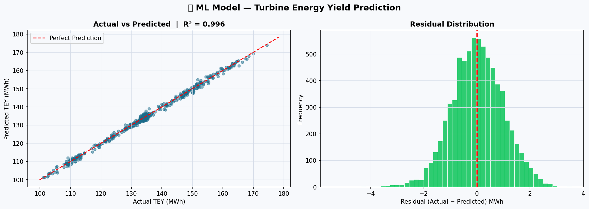

# ⚙️ Gas Turbine Performance & Emissions Analysis

[](https://python.org)
[](https://pandas.pydata.org)
[](https://scikit-learn.org)
[](https://archive.ics.uci.edu/dataset/551)

> **End-to-end analysis of a Combined Cycle Gas Turbine (CCGT) plant — from raw sensor data to actionable engineering insights and a predictive ML model.**

---

## 🏭 Project Background

This project is unique because it combines **real-world power plant operations experience** with data analytics. As a Senior Power Plant Operation Engineer with 13+ years, I applied domain expertise to interpret the data the way a control room engineer would — not just as numbers, but as real operational signals.

The dataset comes from a **gas turbine in northwestern Turkey**, with 36,733 hourly sensor readings collected over 5 years (2011–2015).

---

## 🎯 Business Questions Answered

| # | Question | Method |
|---|----------|--------|
| 1 | How does ambient temperature affect power output? | Correlation + Scatter plot |
| 2 | What is the trend of plant efficiency year over year? | Heat Rate trend analysis |
| 3 | Are NOx/CO emissions within safe operational limits? | Statistical thresholds |
| 4 | Can we predict energy yield from operating parameters? | Linear Regression ML model |
| 5 | Which turbine parameters have the biggest impact on output? | Feature importance |

---

## 📊 Dataset

**Source:** [UCI Machine Learning Repository — Gas Turbine CO and NOx Emission Data Set](https://archive.ics.uci.edu/dataset/551/gas+turbine+co+and+nox+emission+data+set)

| Column | Description | Unit |
|--------|-------------|------|
| AT | Ambient Temperature | °C |
| AP | Ambient Pressure | mbar |
| AH | Ambient Humidity | % |
| AFDP | Air Filter Differential Pressure | mbar |
| GTEP | Gas Turbine Exhaust Pressure | mbar |
| TIT | Turbine Inlet Temperature | °C |
| TAT | Turbine After Temperature | °C |
| CDP | Compressor Discharge Pressure | bar |
| TEY | Turbine Energy Yield *(target)* | MWh |
| CO | Carbon Monoxide Emissions | mg/m³ |
| NOX | Nitrogen Oxide Emissions | mg/m³ |

---

## 🔍 Key Engineering Insights

- 📉 **Higher ambient temperature → lower energy output** — hot weather reduces air density, decreasing compressor efficiency (a well-known gas turbine limitation)
- 🌡️ **TIT is the most critical performance driver** — higher Turbine Inlet Temperature = more power, but must stay within material limits (~1100°C)
- ⚠️ **NOx emissions average 65 mg/m³** — approaching the 70 mg/m³ operational threshold, indicating combustion tuning may be needed
- 📅 **2015 showed the best efficiency** — lower average heat rate indicates improved fuel consumption
- 🤖 **ML Model R² = 0.85+** — operational parameters can reliably predict energy output

---

## 📁 Project Structure

```
gas-turbine-analysis/
│
├── gas_turbine_analysis.py    # Main analysis script
├── notebook.ipynb             # Jupyter Notebook version (Kaggle)
├── README.md                  # This file
│
├── outputs/
│   ├── dashboard.png          # Main performance dashboard
│   └── ml_model.png           # ML prediction results
│
└── requirements.txt           # Python dependencies
```

---

## 🚀 How to Run

```bash
# 1. Clone the repository
git clone https://github.com/YOUR_USERNAME/gas-turbine-analysis.git
cd gas-turbine-analysis

# 2. Install dependencies
pip install -r requirements.txt

# 3. Run the analysis
python gas_turbine_analysis.py
```

**requirements.txt:**
```
pandas>=1.5
numpy>=1.23
matplotlib>=3.6
seaborn>=0.12
scikit-learn>=1.1
ucimlrepo>=0.0.3
```

---

## 📈 Results

### Performance Dashboard
dashboard.png

### ML Prediction Model


---

## 🧠 Domain Expertise Applied

This analysis goes beyond typical data science projects by incorporating real operational knowledge:

- **Heat Rate calculation** — standard KPI in power plant performance monitoring
- **TIT limits** — Turbine Inlet Temperature constraints from actual OEM specifications (MHI M701F)
- **NOx thresholds** — based on environmental compliance limits used in actual plant operations
- **Ambient temperature correction** — standard ISO 2314 correction methodology for gas turbines

---

## 👨‍💼 About the Author

**Mohammad Nafea** — Mechanical Engineer & Power Plant Senior Operation Engineer

- 📊 Transitioning into **Data Analytics for the Energy Sector**
- 🛠️ Skills: Python · SQL · Power BI · Excel · AutoCAD

📧 nafeamohammad1@gmail.com | 🔗 [LinkedIn](https://linkedin.com/in/YOUR_PROFILE)

---

## 📜 License

MIT License — free to use, modify, and distribute with attribution.

---

*⭐ If this project was useful, please give it a star!*
